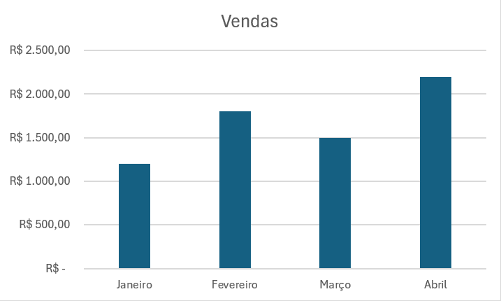
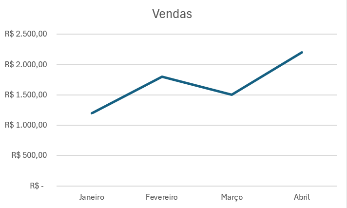
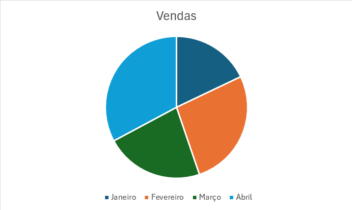
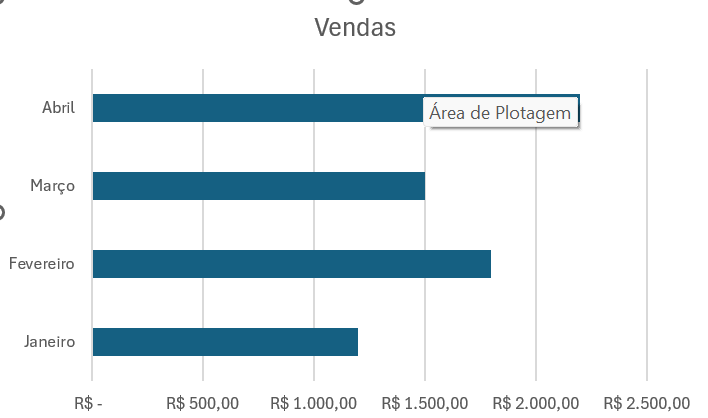
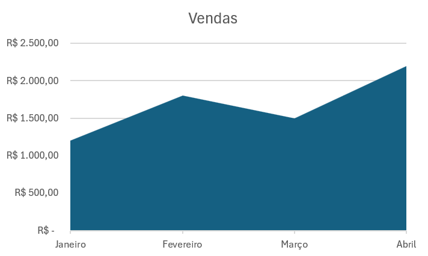

# Gráficos no Excel

Os gráficos no Excel servem para **transformar dados em informações visuais**, facilitando análises, comparações e apresentações.

---

# 1. O que é um gráfico?

Um gráfico é uma representação visual dos dados de uma tabela.

Exemplo de tabela:

| Mês | Vendas |
|---|---|
| Janeiro | 1200 |
| Fevereiro | 1800 |
| Março | 1500 |
| Abril | 2200 |

Com essa tabela, o Excel pode gerar gráficos automaticamente.

---

# 2. Principais tipos de gráficos no Excel

---

## 2.1 Gráfico de Colunas

Usado para:
- Comparar valores
- Mostrar crescimento
- Comparar categorias

Exemplo:
- Vendas por mês
- Quantidade de alunos por turma

### Como criar:
1. Selecione os dados
2. Clique em **Inserir**
3. Escolha **Colunas**
4. Selecione o modelo desejado

---

## 2.2 Gráfico de Linhas

Usado para:
- Mostrar evolução no tempo
- Tendências
- Crescimento e queda

Exemplo:
- Temperatura diária
- Crescimento de faturamento

### Muito usado para:
- Dados mensais
- Dados anuais
- Monitoramento

---

## 2.3 Gráfico de Pizza

Usado para:
- Mostrar porcentagens
- Mostrar participação

Exemplo:
- Participação de mercado
- Distribuição de gastos

### Atenção:
Evite usar muitas categorias, pois o gráfico fica poluído.

---

## 2.4 Gráfico de Barras

Parecido com colunas, mas horizontal.

Usado quando:
- Os nomes são grandes
- Há muitas categorias

---

## 2.5 Gráfico de Área

Mostra evolução com preenchimento colorido.

Usado para:
- Mostrar volume acumulado
- Comparar crescimento

---

# Como criar um gráfico no Excel

## Passo a passo

### Passo 1 — Criar a tabela

Exemplo:

| Produto | Quantidade |
|---|---|
| Mouse | 50 |
| Teclado | 35 |
| Monitor | 20 |

---

### Passo 2 — Selecionar os dados

Selecione toda a tabela.

---

### Passo 3 — Inserir gráfico

Clique em:
- **Inserir**
- Escolha o tipo de gráfico

---

### Passo 4 — Personalizar

Você pode alterar:
- Título
- Cores
- Legendas
- Estilo
- Eixos

---

# Elementos de um gráfico

---

## Título

Mostra o assunto do gráfico.

Exemplo:
- “Vendas Mensais”

---

## Eixo Horizontal (X)

Normalmente:
- Categorias
- Meses
- Produtos

---

## Eixo Vertical (Y)

Normalmente:
- Valores
- Quantidades
- Preços

---

## Legenda

Identifica as informações do gráfico.

---

## Rótulos de Dados

Mostram os números diretamente no gráfico.

---

# Formatação de gráficos

Você pode:
- Alterar cores
- Trocar fontes
- Inserir sombras
- Aplicar estilos prontos

### Como acessar:
Clique no gráfico → guia **Design do Gráfico**

---

# Gráficos Dinâmicos

Os gráficos podem atualizar automaticamente quando os dados mudam.

Exemplo:
- Alterou a tabela → gráfico atualiza sozinho.

---

# Gráfico com Tabela Dinâmica

Muito usado em:
- Dashboards
- Relatórios
- Business Intelligence

Permite:
- Filtrar dados
- Criar análises rápidas
- Resumos automáticos

--- 
# Qual gráfico usar?

| Situação | Melhor gráfico |
|---|---|
| Comparar valores | Colunas |
| Mostrar evolução | Linhas |
| Mostrar porcentagens | Pizza |
| Muitos nomes | Barras |
| Crescimento acumulado | Área |

---

# Exercícios — Gráficos no Excel

---

# Exercício 1 — Gráfico de Colunas

## Tabela

| Produto | Quantidade Vendida |
|---|---|
| Mouse | 120 |
| Teclado | 80 |
| Monitor | 45 |
| Headset | 60 |
| Webcam | 30 |

---

## Solicitação

Utilizando a tabela acima:

1. Crie um **Gráfico de Colunas**.
2. O gráfico deve possuir:
   - Título: **Vendas de Produtos**
   - Rótulos de dados
---

# Exercício 2 — Gráfico de Pizza

## Tabela

| Categoria | Valor Gasto |
|---|---|
| Alimentação | 850 |
| Transporte | 320 |
| Internet | 120 |
| Energia | 260 |
| Lazer | 450 |

---

## Solicitação

Utilizando a tabela acima:

1. Crie um **Gráfico de Pizza**.
2. O gráfico deve possuir:
   - Título: **Distribuição de Gastos**
   - Porcentagens visíveis
   - Legenda posicionada à direita

---

# Exercício 3 — Gráfico de Linhas

## Tabela

| Mês | Faturamento |
|---|---|
| Janeiro | 1500 |
| Fevereiro | 1800 |
| Março | 2100 |
| Abril | 2400 |
| Maio | 2600 |
| Junho | 3000 |

---

## Solicitação

Utilizando a tabela acima:

1. Crie um **Gráfico de Linhas**.
2. O gráfico deve possuir:
   - Título: **Evolução do Faturamento**
   - Marcadores nos pontos da linha
   - Linha suavizada
3. Insira rótulos de dados.

---

# Exercício 4 — Gráfico de Barras

## Tabela

| Funcionário | Quantidade de Atendimentos |
|---|---|
| Carlos | 45 |
| Mariana | 60 |
| João | 30 |
| Fernanda | 75 |
| Lucas | 50 |

---

## Solicitação

Utilizando a tabela acima:

1. Crie um **Gráfico de Barras Horizontais**.
2. O gráfico deve possuir:
   - Título: **Atendimentos por Funcionário**
   - Barras coloridas
   - Rótulos de dados

---

# Exercício 5 — Gráfico de Área

## Tabela

| Mês | Produção |
|---|---|
| Janeiro | 500 |
| Fevereiro | 700 |
| Março | 850 |
| Abril | 900 |
| Maio | 1200 |
| Junho | 1400 |

---

## Solicitação

Utilizando a tabela acima:

1. Crie um **Gráfico de Área**.
2. O gráfico deve possuir:
   - Título: **Crescimento da Produção**
   - Área preenchida com cor personalizada
   - Legenda visível
3. Adicione rótulos de dados.
---

# Exercício 6 — Desafio

## Tabela

| Aluno | Nota |
|---|---|
| Ana | 8,5 |
| Bruno | 6,0 |
| Camila | 9,2 |
| Diego | 7,5 |
| Elisa | 8,8 |

---

## Solicitação

Utilizando a tabela acima:

1. Escolha o tipo de gráfico que você considera mais adequado.
2. Crie o gráfico.
3. O gráfico deve possuir:
   - Título personalizado
   - Rótulos de dados
   - Cores personalizadas
