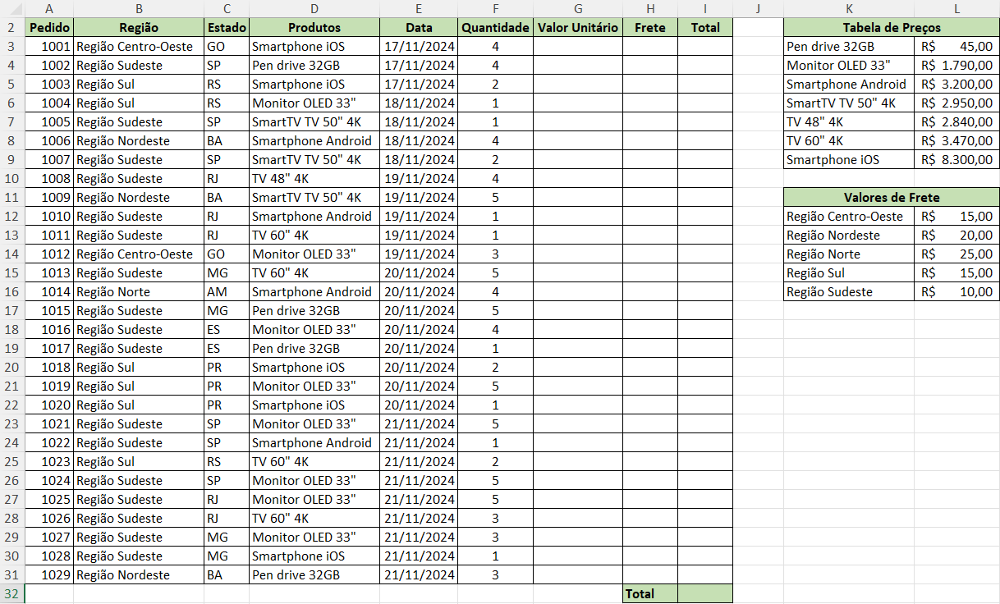
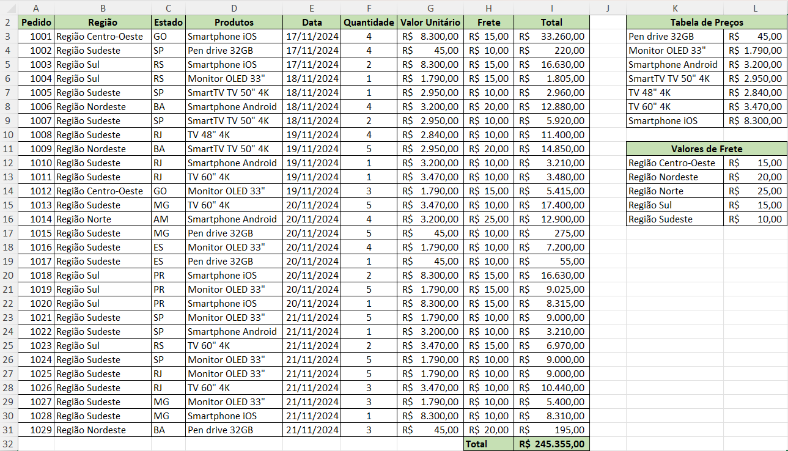

# Aula de Excel — PROCV e PROCH

As funções `PROCV` e `PROCH` são utilizadas para buscar informações em tabelas.

---

# O que é PROCV (VLOOKUP)?

O `PROCV` significa:

```text
PROCurar na Vertical
```

Ele procura um valor na primeira coluna de uma tabela e retorna informações de outra coluna.

---

# Sintaxe do PROCV

```excel
=PROCV(valor_procurado;tabela;núm_índice_coluna;[procurar_intervalo])
```

---

# Parâmetros

| Parâmetro | Função |
|---|---|
| valor_procurado | Valor que deseja encontrar |
| tabela | Intervalo da tabela |
| núm_índice_coluna | Coluna que deseja retornar |
| procurar_intervalo | VERDADEIRO ou FALSO |

---

# IMPORTANTE

## Use FALSO para busca exata

```excel
=PROCV(A2;A10:D20;2;FALSO)
```

---

# Exemplo Básico — Cadastro de Produtos

| Código | Produto | Preço |
|---|---|---|
| 101 | Mouse | 50 |
| 102 | Teclado | 120 |
| 103 | Monitor | 900 |

---

## Buscar o nome do produto

### Fórmula

```excel
=PROCV(102;A2:C4;2;FALSO)
```

---

## Resultado

```text
Teclado
```

---

# Como o PROCV funciona

O Excel:

1. Procura `102` na primeira coluna
2. Encontra na linha do teclado
3. Retorna a coluna 2

---

# Exemplo — Buscar preço

```excel
=PROCV(103;A2:C4;3;FALSO)
```

Resultado:

```text
900
```

---

# Erros comuns no PROCV

| Erro | Motivo |
|---|---|
| #N/D | Valor não encontrado |
| #REF! | Coluna inexistente |
| Resultado errado | Uso incorreto do VERDADEIRO |

---

# O que é PROCH (HLOOKUP)?

O `PROCH` significa:

```text
PROCurar na Horizontal
```

Ele procura valores na primeira linha da tabela.

---

# Sintaxe do PROCH

```excel
=PROCH(valor_procurado;tabela;núm_índice_linha;[procurar_intervalo])
```

---

# Exemplo de PROCH

|   | A | B | C |
|---|---|---|---|
| 1 | Janeiro | Fevereiro | Março |
| 2 | 1000 | 1500 | 2000 |

---

## Buscar valor de Fevereiro

```excel
=PROCH("Fevereiro";A1:C2;2;FALSO)
```

Resultado:

```text
1500
```

---

# Diferença entre PROCV e PROCH

| PROCV | PROCH |
|---|---|
| Busca vertical | Busca horizontal |
| Procura na coluna | Procura na linha |

---

# Quando usar cada um?

| Situação | Melhor função |
|---|---|
| Cadastro de clientes | PROCV |
| Tabela mensal horizontal | PROCH |
| Estoque | PROCV |
| Metas mensais | PROCH |

---

# EXERCÍCIOS BÁSICOS

# Exercício 1 — PROCV Básico

## Tabela

| Código | Produto | Preço |
|---|---|---|
| 201 | Caderno | 25 |
| 202 | Caneta | 5 |
| 203 | Mochila | 120 |
| 204 | Régua | 8 |

---

## Faça:

1. Busque o nome do produto código 203
2. Busque o preço do código 202


# Exercício 2 — PROCH Básico

## Tabela

|   | Janeiro | Fevereiro | Março | Abril |
|---|---|---|---|---|
| Vendas | 1500 | 2200 | 1800 | 3000 |

---

## Faça:

1. Busque as vendas de Março
2. Busque as vendas de Abril

---

# Exercício 3 — Sistema de Funcionários

## Tabela

| Matrícula | Funcionário | Cargo | Salário |
|---|---|---|---|
| 1001 | Carlos | Analista | 4500 |
| 1002 | Mariana | Gerente | 8500 |
| 1003 | João | Suporte | 3000 |
| 1004 | Fernanda | RH | 5000 |
| 1005 | Ricardo | Diretor | 12000 |

---

# Faça

Crie um sistema onde o usuário digita a matrícula e o Excel retorna:

- Nome
- Cargo
- Salário

---

# VPS02 (Verificação Prática Formativa 02)
## Situação de aprendizagem:
|Planilha com cálculos de faturamento de vendas|
|-|
||
- Dados para preencher a planilha principal sem a necessidade de digitação
```
1001	Região Centro-Oeste	GO	Smartphone iOS	17/11/2024	4
1002	Região Sudeste	SP	Pen drive 32GB	17/11/2024	4
1003	Região Sul	RS	Smartphone iOS	17/11/2024	2
1004	Região Sul	RS	Monitor OLED 33"	18/11/2024	1
1005	Região Sudeste	SP	SmartTV TV 50" 4K	18/11/2024	1
1006	Região Nordeste	BA	Smartphone Android	18/11/2024	4
1007	Região Sudeste	SP	SmartTV TV 50" 4K	18/11/2024	2
1008	Região Sudeste	RJ	TV 48" 4K	19/11/2024	4
1009	Região Nordeste	BA	SmartTV TV 50" 4K	19/11/2024	5
1010	Região Sudeste	RJ	Smartphone Android	19/11/2024	1
1011	Região Sudeste	RJ	TV 60" 4K	19/11/2024	1
1012	Região Centro-Oeste	GO	Monitor OLED 33"	19/11/2024	3
1013	Região Sudeste	MG	TV 60" 4K	20/11/2024	5
1014	Região Norte	AM	Smartphone Android	20/11/2024	4
1015	Região Sudeste	MG	Pen drive 32GB	20/11/2024	5
1016	Região Sudeste	ES	Monitor OLED 33"	20/11/2024	4
1017	Região Sudeste	ES	Pen drive 32GB	20/11/2024	1
1018	Região Sul	PR	Smartphone iOS	20/11/2024	2
1019	Região Sul	PR	Monitor OLED 33"	20/11/2024	5
1020	Região Sul	PR	Smartphone iOS	20/11/2024	1
1021	Região Sudeste	SP	Monitor OLED 33"	21/11/2024	5
1022	Região Sudeste	SP	Smartphone Android	21/11/2024	1
1023	Região Sul	RS	TV 60" 4K	21/11/2024	2
1024	Região Sudeste	SP	Monitor OLED 33"	21/11/2024	5
1025	Região Sudeste	RJ	Monitor OLED 33"	21/11/2024	5
1026	Região Sudeste	RJ	TV 60" 4K	21/11/2024	3
1027	Região Sudeste	MG	Monitor OLED 33"	21/11/2024	3
1028	Região Sudeste	MG	Smartphone iOS	21/11/2024	1
1029	Região Nordeste	BA	Pen drive 32GB	21/11/2024	3
```
- Copie e cole os dados na sua planilha do Excel.
## Desafios
- 1 Utilizando a função **PROCV()** preencha a coluna **G "Valor unitário"** buscando os dados na **tabela** ao lado
- 2 Também utilizando a função **PROCV()** preencha a coluna **H "Frete"** buscando os dados na **tabela** ao lado.
- 3 Calcule o total na coluna **I "Total", o frete é por produto, verifique a quantidade de cada produto e some ao frete.
- 4 Calcule o "Total" geral na célula **I32**
---
|Planilha com os valores calculados para conferência|
|-|
||