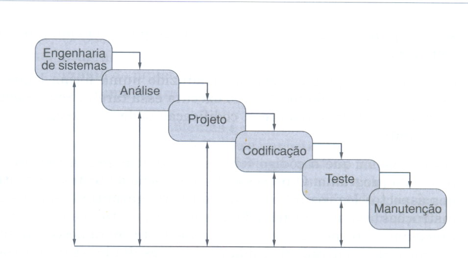
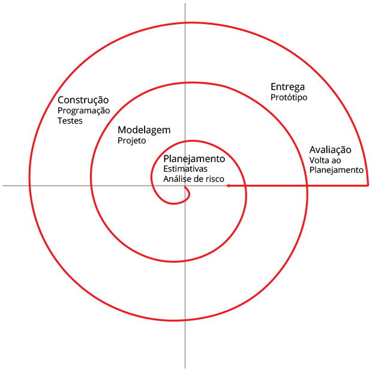
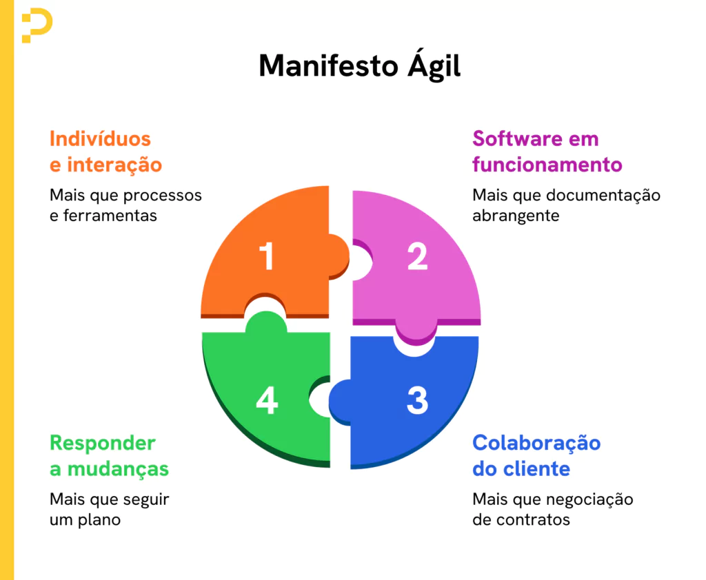
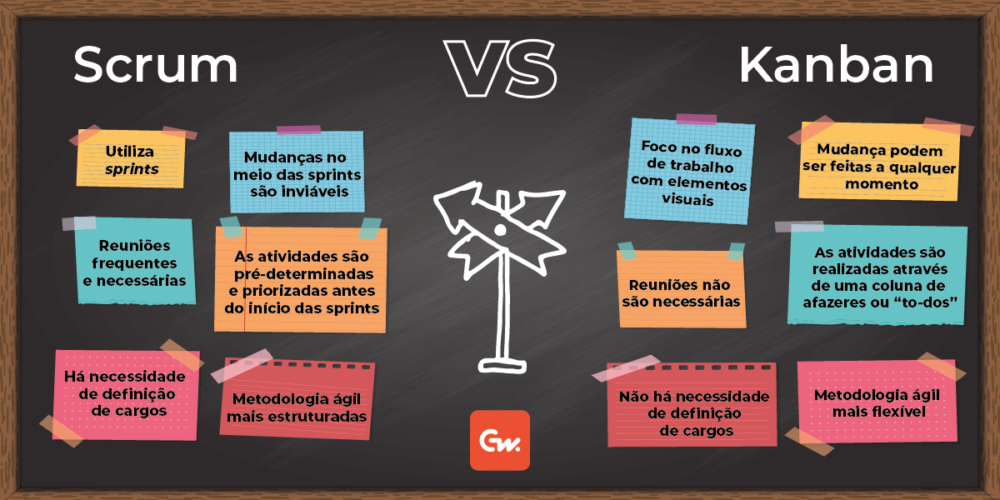
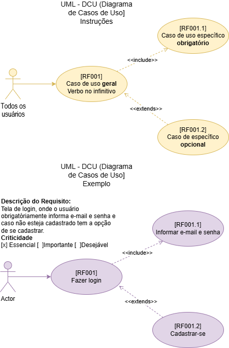
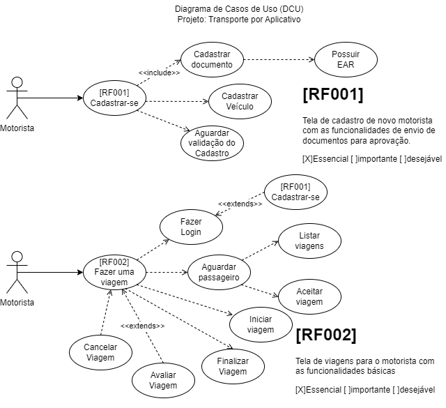
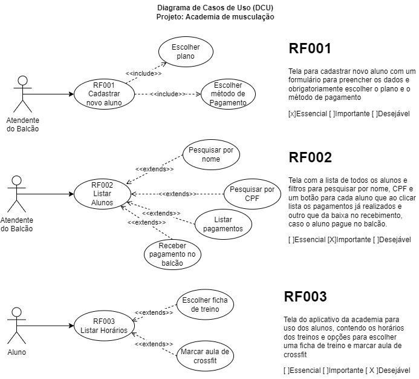
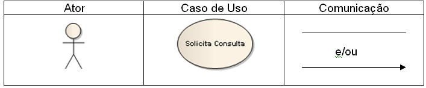
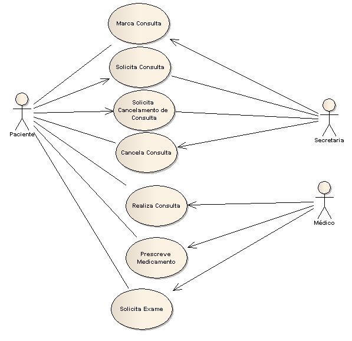
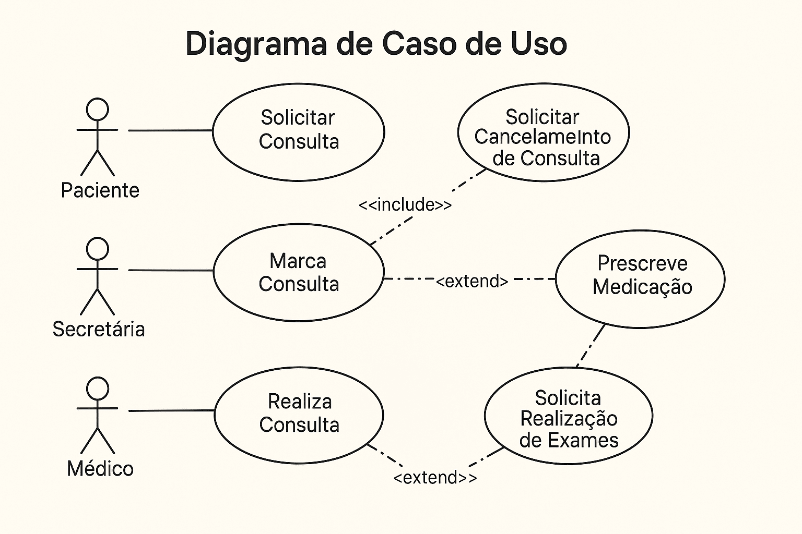

# Aula02
## Capacidades Básicas:
- 2 Registrar requisitos funcionais e não funcionais, de acordo com as informações coletadas com o cliente.
- 3 Identificar práticas ágeis de acordo com as características e requisitos do projeto

## Conhecimentos
- 3 Gerenciamento de Requisitos
    - 3.1 Definição
    - 3.2 Gestão de mudanças
    - 3.3 Validação de requisitos
- 4 Documentação de Requisitos
    - 4.1 Normas técnicas
    - 4.2 Estrutura padrão (modelos de documentação)
    - 4.3 Controle de Versões

## Metodologias
Duas são as metodologias aplicadas a engenharia de software, metodologia clássica e metodologia ágil.
### Metodologia Clássica
Pautada em etapas bem definidas onde o produto "software" é entregue ao cliente nas etapas finais, logo apos doversos testes e é fechado um contrato de manutenção geralmente. Dentro da metodologia clpassica temos algumas abordagens
- **Cascata** (Waterfall)
- 
- **Espiral**
- 
### Metodologia ágil
O Manifesto Ágil (ou Manifesto para Desenvolvimento Ágil de Software) é um documento criado em 2001 por 17 desenvolvedores de software, que estabeleceu quatro valores fundamentais e doze princípios para guiar formas mais flexíveis, colaborativas e rápidas de desenvolver projetos

Algumas abordagens da metodologia ágil são SCRUM e KANBAN:


## Documentação de Requisitos
Tanto em metodologias clássicas ou ágeis os **requisitos** são o ponto de partida para a engenharia de software por encomenda. A correta documentação é essencial.

### UML
UML (Unified Modeling Language, ou Linguagem de Modelagem Unificada) é uma linguagem gráfica padronizada, utilizada para visualizar, especificar, construir e documentar sistemas de software orientados a objetos. Ela utiliza diagramas visuais (como de classes, casos de uso e sequência) para facilitar a comunicação entre desenvolvedores e partes interessadas, simplificando sistemas complexos.

### UML DCU (Diagrtama de Casos de Uso)
O Diagrama de Casos de Uso é uma ferramenta de modelagem visual, parte da Linguagem de Modelagem Unificada (UML), utilizada para descrever as **funcionalidades (requisitos funcionais)** de um sistema sob a perspectiva do usuário final
#### UML - DCU


#### Exemplo02
- Sistema de transporte por aplicativo<br>

- Sistema de controle de aulas em uma academia<br>


### Criticidades
- **Essencial**: Sem este requisito o sistema não funciona
- **Importante**: O sistema funciona sem, porém não resolve o problema completo
- **Desejável**: "A cereja do bolo" Melhora a UX (Experiência do Usuário), porém se não for implementado o sistema cumpre seu papel.

---
# Reforço UML

Esse diagrama documenta o que o sistema faz do ponto de vista do usuário. Em outras palavras, ele descreve as principais funcionalidades do sistema e a interação dessas funcionalidades com os usuários do mesmo sistema. Nesse diagrama não nos aprofundamos em detalhes técnicos que dizem como o sistema faz.

Este artefato é comumente derivado da especificação de requisitos, que por sua vez não faz parte da UML. Pode ser utilizado também para criar o documento de requisitos.

Diagramas de Casos de Uso são compostos basicamente por quatro partes:

- **Cenário:** Sequência de eventos que acontecem quando um usuário interage com o sistema.
- **Ator:** Usuário do sistema, ou melhor, um tipo de usuário.
- **Use Case:** É uma tarefa ou uma funcionalidade realizada pelo ator (usuário)
- **Comunicação:** é o que liga um ator com um caso de uso

## Cenário de exemplo para vermos a notação de um diagrama de caso de uso

“A clínica médica Saúde Perfeita precisa de um sistema de agendamento de consultas e exames. Um paciente entra em contato com a clínica para marcar consultas visando realizar um check-up anual com seu médico de preferência. A recepcionista procura data e hora disponível mais próxima na agenda do médico e marca as consultas. Posteriormente o paciente realiza a consulta, e nela o médico pode prescrever medicações e exames, caso necessário”.

--- 

### definir nossos atores:

- Paciente
- Secretária
- Médico

Agora vamos definir algumas ações de cada usuário:

- Paciente
    - Solicita Consulta
    - Solicita Cancelamento de Consulta
- Secretária
    - Consulta Agenda
    - Marca Consulta
    - Cancela Consulta
- Médico
    - Realiza Consulta
    - Prescreve Medicação
    - Solicita Realização de exames

Agora já temos uma relação de atores e ações relacionadas a esses atores. Poderíamos criar um documento textual (como foi feito acima), para registrar nossos atores e funcionalidades. Mas o leitor não concorda que uma imagem vale mais que mil palavras?


---
Podemos agora construir o diagrama:



Para melhorar um pouco mais esse diagrama vamos ver o conceito de <>. Include e extend são relações entre os casos de uso.

- **Include:** seria a relação de um caso de uso que para ter sua funcionalidade executada precisa chamar outro caso de uso.
- **Extend:** Esta relação significa que o caso de uso extendido vai funcionar exatamente como o caso de uso base só que alguns passos novos inseridos no caso de uso extendido.

### Diagrama de caso de Uso (DCUs)


---
## Boas Práticas
1. Comece sempre pela identificação dos atores
Antes de pensar nas funcionalidades, identifique quem vai interagir com o sistema. Atores são externos ao sistema, mas interagem com ele. Liste-os antes de criar qualquer funcionalidade. Os atores podem ser:

    - Pessoas (usuário, gerente, cliente)
    - Sistemas externos (como APIs ou outros softwares)

2.  Perspectiva do usuário
Foque nas funcionalidades sob a perspectiva do usuário, não se preocupe com a parte técnica, concentre-se em o que o sistema deve fazer, no que cada ator espera obter do sistema. Exemplos:

    - Solicitar Consulta
    - Emitir Relatório
    - Cadastrar Produto

3.  Relacionamentos <include> e <extend>
Use setas tracejadas para representar esses relacionamentos, com rótulo claro.
```
    <<include>>: quando um caso de uso sempre utiliza outro.
    <<extend>>: quando um caso de uso pode opcionalmente estender outro.
```

4. Validação do diagrama
Diagramas de caso de uso são ótimos para reuniões de alinhamento e levantamento de requisitos. Use os diagramas como ponte de entendimento entre equipe técnica e cliente. Por exemplo compartilhe e pergunte:

    - Está claro o que o sistema vai fazer?
    - Há funcionalidades faltando?

5. Mantenha nomes objetivos e claros
Um bom nome evita mal-entendidos e melhora a legibilidade dos diagramas. Evite jargões técnicos. Prefira nomes como "Cadastrar Cliente" ao invés de "Executar Interface de Cadastro de Pessoa Física".

6. Documente
Para cada funcionalidade (caso de uso) documente cenários para cada caso de uso, descreva:

    - Fluxo principal (ex: sequência normal do processo)
    - Fluxos alternativos (ex: erro no pagamento)
    - Fluxo de exceção (ex: dados inválidos)
---
#### Atividades
Em seu caderno, ilustre os requisitos funcionais a seguir através de DCUs, um para cada requisito.

#### 1 - Sistema de controle de estoque de loja de roupas
- [RF001] **Tela de login**, contendo os campos email e senha e direcionando os **usuários** (Funcionários comuns e Gerência) para suas respectivas telas principais, caso suas credenciais sejam válidas, senão informa erro de login.
- [RF002] **Dashboard do estoque**, tela com um relatório de movimentações no estoque em forma de tabela e gráfico comparando os investimentos (Compras de produtos) e as vendas efetivas, acessada somente pelo **gerente** da loja.
- [RF003] **Tela de cadastro de mercadorias**, contendo os campos básicos como id (identificação para evitar produtos duplicados, gerada automaticamente pelo sistema), nome, descrição, preço e quantidade, todos os campos são obrigatórios, possui um campo de busca por nome para verificar se a mercadoria já não está cadastrada, acessada pelo **gerente** da loja.
- [RF004] **Tela de registro de Entradas (Compras)**, contendo os dados de aquisição/compra de mercadorias como quantidade, custo unitário e despesas gerais, cada compra registrada altera a quantidade de produtos no cadastro acrescentando a quantidade adquirida, acessada pelos **compradores** da loja.
- [RF005] **Tela de registro de Saídas (Vendas)**, contendo os dados do pedido de mercadorias como quantidade, preço unitário, subtotais, despesas de frete, mais impostos, valor total da venda. Cada venda registrada altera a quantidade de produtos no cadastro diminuindo a quantidade, acessada pelos **vendedores** da loja.
- [RF006] **Tela de cadastro de novo funcionário**, acessada somente pelo **gerente** da loja, onde ele preenche os dados no novo funcionário como nome, cargo, e-mail e senha provisória para que ele troque no primeiro acesso.


