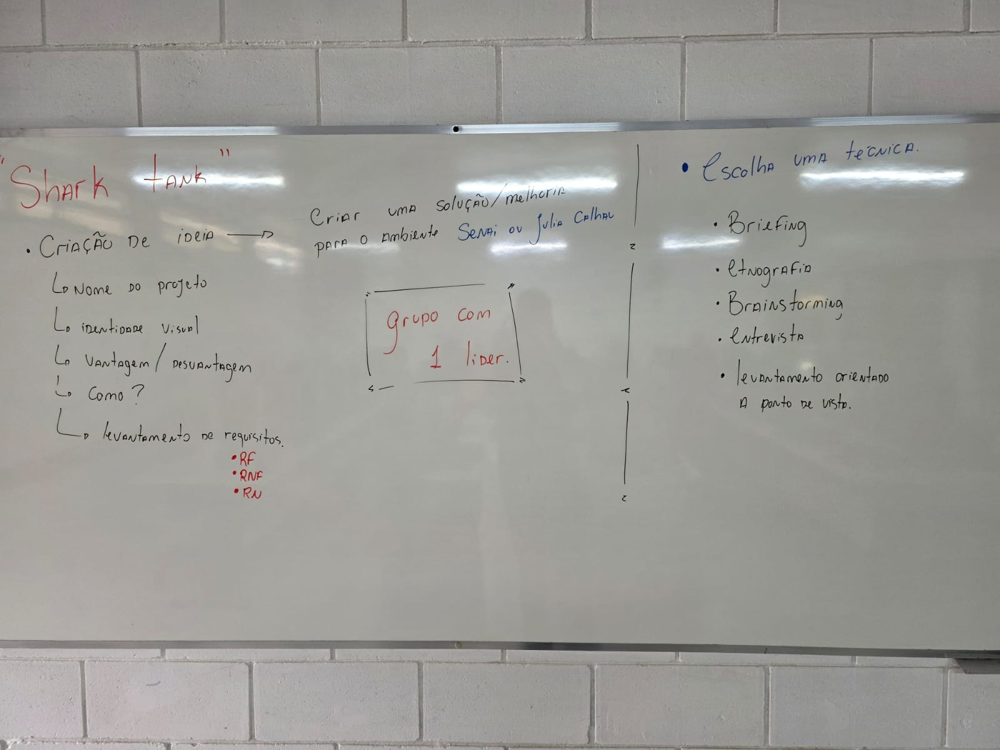

# Atividade de compensação
---

---

## Modo de entrega:
- Apresentação pode ser Slide

- Documentação deve ter:
    - capa
    - nome do grupo 
    - objetivo 
    - introdução do problema a ser resolvido
    - técnica utilizada
    - requisitos coletados
    - solução e conclusão.

- Criar um repositório no Github do lider.
- Salvar apresentação
- Salvar documentação

- Criar um REAMD.md
    - Colocar nome do grupo
    - Fazer um breve resumo do trabalho
    - Colocar os requisitos coletados.

Preencher o formulário: https://forms.cloud.microsoft/r/tV8n4ugVGG