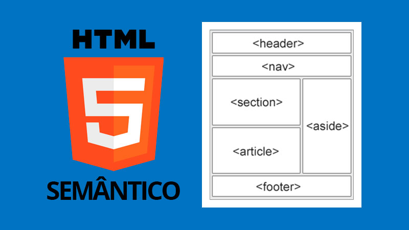

# HTML Semântico:


| Tag            | Para que serve                                                                                                    |
| -------------- | ----------------------------------------------------------------------------------------------------------------- |
| `<header>`     | Representa o **cabeçalho** de uma página ou de uma seção. Pode conter logo, título, menu etc.                     |
| `<nav>`        | Representa uma área de **navegação**, normalmente contendo links para outras páginas ou partes do site.           |
| `<main>`       | Representa o **conteúdo principal** da página. Deve existir, normalmente, apenas um `<main>` por página.          |
| `<section>`    | Representa uma **seção temática** do conteúdo, geralmente com um título.                                          |
| `<article>`    | Representa um **conteúdo independente**, como uma notícia, postagem, artigo ou publicação.                        |
| `<aside>`      | Representa um conteúdo **secundário ou complementar**, como uma barra lateral, dicas ou informações relacionadas. |
| `<footer>`     | Representa o **rodapé** de uma página ou seção. Pode conter copyright, contatos, links etc.                       |
| `<figure>`     | Representa um conteúdo visual ou ilustrativo, como **imagem, gráfico ou diagrama**.                               |
| `<figcaption>` | Adiciona uma **legenda** ou descrição para o conteúdo dentro de `<figure>`.                                       |
| `<address>`    | Representa **informações de contato** do autor ou responsável pelo conteúdo.                                      |
| `<time>`       | Representa uma **data ou horário**.                                                                               |
| `<mark>`       | Destaca um trecho de texto, como se fosse um **marcador de texto**.                                               |
| `<details>`    | Cria uma área que pode ser **expandida ou recolhida** pelo usuário.                                               |
| `<summary>`    | Define o **título clicável** de um `<details>`.                                                                   |


```html
<!DOCTYPE html>
<html lang="pt-BR">
<head>
    <!-- Define a codificação de Caracteres-->
    <meta charset="UTF-8">

    <!-- Faz a página se adaptar a diferentes dispositivos / RESPONSIVO -->
    <meta name="viewport" content="width=device-width, initial-scale=1.0">

    <!-- Título que aparece na aba do navegador -->
    <title>Semântica</title>

     <link rel="stylesheet" href="style.css">
</head>
<body>

    <header>
        <!-- Título PRINCIPAL do site -->
         <h1>Boliiinha de golf</h1>

         <p>Meu bloguinho sobre tecnoloooogia</p>
    </header>

    <hr>

    <nav>
        <!-- Links de navegação -->
         <a href="#inicio"> Ínicio </a>

         <a href="#html"> HTML </a>

         <a href="#CSS"> CSS </a>
         
         <a href="#javascript"> JavaScript </a>

         <a href="#contato"> Contato </a>
    </nav>
    <hr>
    <main id="inicio">

        <section>
            <h2>Aprenda desenvolvimento Weberson</h2>

            <p> Aprenda HTML, CSS, JS para criar sites INCRIIIVEIS. ALEGRIAAAA</p>
        </section>

        <hr>
        <!-- Artigo sobre HTML -->
        <article id="html">
            <header>
                <h2>O que é HTML??</h2>
                <p>publicado em 
                    <time datetime="2026-08-18">
                        18 de agosto de 2026
                    </time>
                </p>

            </header>

            <p> HTML é uma linguagem de marcação, utilizada para estruturar uma página Weberson</p>
            <p>serve pra gente criar Título, paragrafos, listas, tabelas, formulários e várias outras coisas</p>

        </article>

        <article id="css">

            <h2> O qué é CSS?? hãn? me diz!</h2>

            <p>Ele é utilizeeeido para estilizar uma página HTML</p>
        </article>

        <article id="javascript">
            <h2>O que é JavaScript? num seeei, me fala ai?</h2>
            <p>Adicionar comportamentos e interatividades à página?</p>
        </article>

        <!-- Conteúdo Complementar -->
        <hr>
        <aside>
            <h2>Pode estudar mais: </h2>
            <ul>
                <li>Git e Github</li>
                <li>Node.js</li>
                <li>Banco de Dados</li>
                <li>APIs</li>
            </ul>
        </aside>

    </main>
    <hr>
    <!-- RODAPÉ -->
    <footer id="contato">
        <h2>Contatos:</h2>
        <p>Entre em contato pelo Site:</p>
        <address>
            contato@biruleibe.com
        </address>
        <p> &copy; 2026 APRENDA LEGALZINHO</p>

    </footer>

</body>
</html>
```

---

# Exemplo de CSS

```css
/* CONFIGURAÇÕES GERAIS DA PÁGINA */

/* O * (asterisco) seleciona TODOS os elementos da página */

* {
    
    box-sizing: border-box;
} 

body {
    /* Define a fonte utilizada */
    font-family: Arial, sans-serif;
    /* Remove a margem padrão do navegador */
    margin: 0;
    /* Mudando a cor de fundo */
    background-color: #f4f4f4;
    /* Definir a cor padrão dos textos */
    color: #333;
}

header {
    background-color: #222;
    color: white;
    /* Espaçamento interno. */
    padding: 30px;
    /* Centralizar o texto */
    text-align: center;
}

header h1 {
    /* Remover a margem superior */
    margin-top: 0;
}

nav {
    background-color: #333;
    text-align: center;
    padding: 15px;
}

nav a {
    color: white;
    /*removi o sublinhado */
    text-decoration: none;
    /*espaçamento entre os links */
    /* 1º -> cima e de baixo / 2º -> direira e esquerda*/
    margin: 0 15px;
}

nav a:hover{
    color: #00aaff;
}

main{
    /*Define uma largura máxima do elemento */
    max-width: 1000px;
    /*Centraliza o conteudo*/
    margin: 30px auto;
    /* Espaçamento Lateral */
    padding: 0 20px;
}

section{
    background-color: white;
    /* espaçamento interno */
    padding: 30px;
    /*Arredonda os cantos */
    border-radius: 10px;
    /*Espaço abaixo da seção */
    margin-bottom: 30px;
}

article{
    background-color: white;
    padding: 25px;
    /* espaçamento entre os article */
    margin-bottom: 20px;
    border-radius: 10px;

}

article h2{
    color: #0066cc
}

aside {
    background-color: #e8f3ff;
    padding: 20px;
    border-left: 5px solid #0066cc;
    /* Margem/espaço de cima */
    margin-top: 20px;
}

footer{
    background-color: #222;
    color: white;
    padding: 30px;
    text-align: center;
}

address{
    font-style: normal;
    color: #00aaff;
}

```

# Exemplo de HTML + JS

```html
<!DOCTYPE html>
<html lang="pt-BR">

<head>
    <meta charset="UTF-8">

    <title>Calculadora</title>
</head>

<body>

    <h1>Calculadora de Soma</h1>

    <!-- Primeiro campo para o usuário digitar um número -->
    <label for="numero1">Primeiro número:</label>

    <input type="number" id="numero1">

    <br><br>


    <!-- Segundo campo para o usuário digitar um número -->
    <label for="numero2">Segundo número:</label>

    <input type="number" id="numero2">

    <br><br>


    <!-- Botão que chama a função somar() -->
    <button onclick="somar()">
        Somar
    </button>


    <!--
        Esse parágrafo começa vazio.
        O JavaScript colocará o resultado aqui.
    -->
    <p id="resultado"></p>


    <script>

        // Criamos uma função chamada somar
        function somar() {

            // Pegamos o primeiro input
            const campoNumero1 = document.getElementById("numero1");

            // Pegamos o segundo input
            const campoNumero2 = document.getElementById("numero2");


            // Pegamos o valor digitado pelo usuário
            const numero1 = Number(campoNumero1.value);

            const numero2 = Number(campoNumero2.value);


            // Fazemos a soma
            const resultado = numero1 + numero2;


            // Encontramos o parágrafo pelo seu ID
            const campoResultado = document.getElementById("resultado");


            // Mostramos o resultado na página
            campoResultado.textContent = "Resultado: " + resultado;

        }

                function subtrair(){
             
            const campoNumero1 = document.getElementById("n1");
            
            const campoNumero2 = document.getElementById("n2");

            
            const numero1 = Number(campoNumero1.value);

            const numero2 = Number(campoNumero2.value);

            
            const resultado = numero1 - numero2;

            
            const campoResultado = document.getElementById("resultado");

            
            campoResultado.textContent = "Resultado: " + resultado;
        }
        
        function multiplicar(){
            
            const campoNumero1 = document.getElementById("n1");
            
            const campoNumero2 = document.getElementById("n2");

            
            const numero1 = Number(campoNumero1.value);

            const numero2 = Number(campoNumero2.value);

            
            const resultado = numero1 * numero2;

            
            const campoResultado = document.getElementById("resultado");

            
            campoResultado.textContent = "Resultado: " + resultado;
        }

        function divisao(){
            
            const campoNumero1 = document.getElementById("n1");
            
            const campoNumero2 = document.getElementById("n2");

            
            const numero1 = Number(campoNumero1.value);

            const numero2 = Number(campoNumero2.value);
            const campoResultado = document.getElementById("resultado");

            if(numero2 === 0){
                campoResultado.textContent = "Não existe divisão por ZERO";
            } else {
                
                const resultado = numero1 / numero2;

                
                campoResultado.textContent = "Resultado: " + resultado;
            }
        }

    </script>

</body>

</html>

```
---

# Formlulário para entregar a atividade.
Formulário será fechamdo as 17h00

https://forms.cloud.microsoft/r/f6RFjA4EeX
