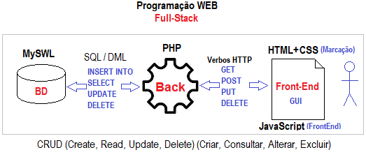

Definição

Um **Web Service** é uma forma de permitir que diferentes sistemas se comuniquem pela internet ou por uma rede local, independentemente da linguagem de programação ou do sistema operacional utilizado.

### Analogia

Imagine que um sistema é um restaurante:

- O **cliente** faz um pedido.
- O **garçom** leva o pedido para a cozinha.
- A **cozinha** prepara o pedido.
- O **garçom** entrega a comida ao cliente.

Em um Web Service:

| Restaurante | Sistema |
|-------------|---------|
| Cliente | Front-end |
| Garçom | API (Web Service) |
| Cozinha | Back-end |
| Comida | Resposta da API |

---

## Funcionamento

```text
Cliente
   │
   ▼
Requisição HTTP
   │
   ▼
Web Service (API)
   │
   ▼
Banco de Dados
   │
   ▲
Resposta (JSON)
```

---

## O que um Web Service pode fazer?

- Consultar informações
- Cadastrar dados
- Atualizar registros
- Excluir informações
- Autenticar usuários
- Integrar sistemas diferentes

### Exemplos de utilização

- Aplicativos bancários
- WhatsApp
- iFood
- Mercado Livre
- Netflix
- Spotify

Todos utilizam Web Services para comunicação entre seus sistemas.

---

# 2.2 REST

REST significa:

**Representational State Transfer**

É um conjunto de boas práticas para construção de APIs.

REST **não é**:

- Uma linguagem
- Um framework
- Um programa

REST é um **estilo de arquitetura**.

Atualmente a maioria das APIs modernas utiliza REST.

---

## Características do REST

Uma API REST deve ser:

- Simples
- Organizada
- Padronizada
- Utilizar HTTP
- Stateless (não mantém estado entre requisições)

Cada requisição deve conter todas as informações necessárias para ser processada.

---

## Comunicação REST

### Cliente

```http
GET /produtos
```

### Servidor

```json
[
    {
        "id": 1,
        "nome": "Notebook",
        "preco": 3500
    },
    {
        "id": 2,
        "nome": "Mouse",
        "preco": 90
    }
]
```

---

# Métodos HTTP

REST utiliza principalmente os seguintes métodos:

| Método | Função |
|---------|---------|
| GET | Buscar informações |
| POST | Criar informações |
| PUT | Atualizar completamente |
| PATCH | Atualizar parcialmente |
| DELETE | Excluir informações |

---

## Exemplos

### Listar usuários

```http
GET /usuarios
```

Resposta:

```json
[
    {
        "id":1,
        "nome":"Carlos"
    },
    {
        "id":2,
        "nome":"Maria"
    }
]
```

---

### Buscar um usuário

```http
GET /usuarios/1
```

Resposta:

```json
{
    "id":1,
    "nome":"Carlos"
}
```

---

### Criar usuário

```http
POST /usuarios
```

Body:

```json
{
    "nome":"João",
    "idade":25
}
```

Resposta:

```json
{
    "id":3,
    "nome":"João",
    "idade":25
}
```

---

### Atualizar usuário

```http
PUT /usuarios/3
```

Body:

```json
{
    "nome":"João Silva",
    "idade":26
}
```

---

### Excluir usuário

```http
DELETE /usuarios/3
```

Resposta:

```http
204 No Content
```

---

# 2.2.1 Recursos

No padrão REST, tudo é considerado um **recurso**.

Um recurso representa qualquer informação manipulada pela API.

Exemplos:

- Usuários
- Produtos
- Clientes
- Pedidos
- Livros
- Funcionários

Cada recurso possui uma URL própria.

```text
/usuarios
```

```text
/produtos
```

```text
/clientes
```

```text
/livros
```

Normalmente um recurso corresponde a uma tabela do banco de dados.

Exemplo:

```
Tabela Usuarios
        │
        ▼
/usuarios
```

---

## Recursos possuem identificadores

Todos os produtos

```http
GET /produtos
```

Produto específico

```http
GET /produtos/15
```

Pedido específico

```http
GET /pedidos/200
```

Cliente específico

```http
GET /clientes/7
```

O número representa o identificador único (ID).

---

## Recursos relacionados

Um cliente possui vários pedidos.

```http
GET /clientes/8/pedidos
```

Um pedido possui vários produtos.

```http
GET /pedidos/120/produtos
```

---

# Boas práticas para recursos

Utilize sempre substantivos.

## Correto

```text
/usuarios
```

```text
/produtos
```

```text
/pedidos
```

## Incorreto

```text
/buscarUsuario
```

```text
/listarProdutos
```

```text
/criarPedido
```

A ação é definida pelo método HTTP.

---

# 2.2.2 Semântica da URL REST

A URL representa **o recurso**, e não a ação.

## Exemplo incorreto

```http
GET /buscarUsuarios
```

## Correto

```http
GET /usuarios
```

---

## Outro exemplo

Errado

```http
POST /criarUsuario
```

Correto

```http
POST /usuarios
```

---

Errado

```http
DELETE /deletarProduto/8
```

Correto

```http
DELETE /produtos/8
```

---

## URLs devem ser simples

Correto

```text
/produtos
```

```text
/produtos/12
```

```text
/clientes/5/pedidos
```

Evite

```text
/produto123
```

```text
/dadosClientesNovos
```

```text
/lista_de_produtos
```

---

## Utilize substantivos no plural

Correto

```text
/usuarios
```

```text
/produtos
```

```text
/clientes
```

Evite

```text
/usuario
```

```text
/produto
```

---

## Não utilize verbos na URL

### Errado

```text
/listarProdutos
```

```text
/criarProduto
```

```text
/editarProduto
```

### Correto

```http
GET /produtos
POST /produtos
PUT /produtos/1
PATCH /produtos/1
DELETE /produtos/1
```

---

## Hierarquia dos recursos

Uma empresa possui funcionários.

Um funcionário possui dependentes.

As URLs ficam assim:

```text
/empresas/5/funcionarios
```

```text
/empresas/5/funcionarios/12
```

```text
/empresas/5/funcionarios/12/dependentes
```

---

# Exemplos de URLs REST

| Objetivo | Método | URL |
|----------|--------|-----|
| Listar usuários | GET | `/usuarios` |
| Buscar usuário | GET | `/usuarios/10` |
| Criar usuário | POST | `/usuarios` |
| Atualizar usuário | PUT | `/usuarios/10` |
| Atualizar parcialmente | PATCH | `/usuarios/10` |
| Excluir usuário | DELETE | `/usuarios/10` |
| Listar pedidos de um cliente | GET | `/clientes/5/pedidos` |
| Buscar um pedido | GET | `/clientes/5/pedidos/20` |

---

# Exemplo utilizando Node.js e Express

```javascript
const express = require("express");

const app = express();

app.use(express.json());

let usuarios = [
    { id: 1, nome: "Carlos" },
    { id: 2, nome: "Maria" }
];

// Listar usuários
app.get("/usuarios", (req, res) => {
    res.json(usuarios);
});

// Buscar usuário
app.get("/usuarios/:id", (req, res) => {
    const usuario = usuarios.find(u => u.id == req.params.id);

    if (!usuario) {
        return res.status(404).json({
            mensagem: "Usuário não encontrado."
        });
    }

    res.json(usuario);
});

// Criar usuário
app.post("/usuarios", (req, res) => {
    const novo = {
        id: usuarios.length + 1,
        nome: req.body.nome
    };

    usuarios.push(novo);

    res.status(201).json(novo);
});

// Atualizar usuário
app.put("/usuarios/:id", (req, res) => {
    const usuario = usuarios.find(u => u.id == req.params.id);

    if (!usuario) {
        return res.status(404).json({
            mensagem: "Usuário não encontrado."
        });
    }

    usuario.nome = req.body.nome;

    res.json(usuario);
});

// Excluir usuário
app.delete("/usuarios/:id", (req, res) => {
    usuarios = usuarios.filter(u => u.id != req.params.id);

    res.status(204).send();
});

app.listen(3000, () => {
    console.log("Servidor executando na porta 3000");
});
```

---

# Resumo

- Web Services permitem a comunicação entre sistemas.
- REST é um padrão para desenvolvimento de APIs.
- Recursos representam entidades como usuários, produtos e clientes.
- A URL deve representar o recurso e não a ação.
- Os métodos HTTP definem a operação realizada.
- Uma boa API REST possui URLs simples, organizadas e padronizadas.