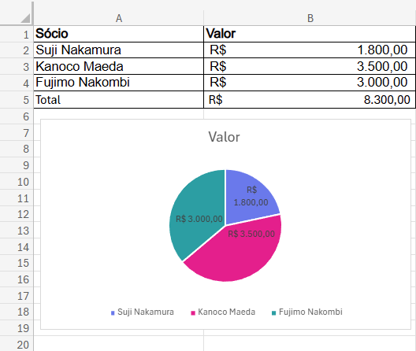
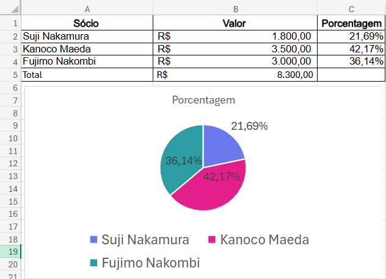
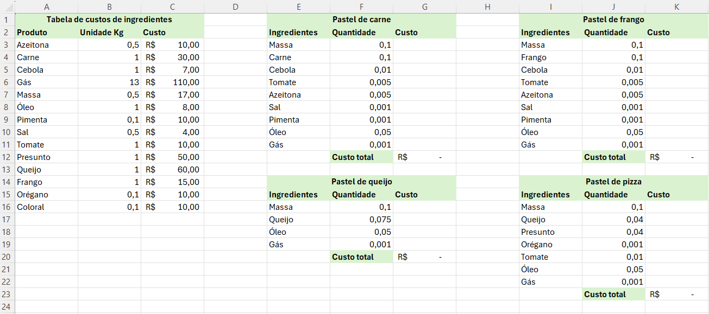

# Aula - Gráficos simples e funções de busca
### Objetivo
O objetivo desta aula é aprender a criar gráficos simples e utilizar funções de busca no Excel.
### Atividades
O gráfico a seguir mostra a composição do capital investido pelos três sócios na barraca de pastel.

O segundo gráfico mostra em porcentagem a participação de cada sócio no capital investido.

## Situação de aprendizagem desafiadora
### Contextualização
Os três Japoneses, Sr. Suji Nakamura, Sra. Kanoco Maeda e o Sr. Fujimo Nakombi decidiram abrir uma barraca de pastel na feira e ao consultar um contador, descobriram que precisavam calcular os custos dos ingredientes para fazer os pasteis e qual o lucro que teriam se vendessem a R$ 10,00 cada pastel.

### Desafio

- 1 Abra o excel e em uma nova planilha digite os dados da imagem acima.
- 2 Formate os dados no formato de moeda conforme indicado na imagem.
- 3 Calcule o custo de cada ingrediente dos quatro sabores de pasteis, utilize a função **PROCV()** para buscar o **custo** do ingrediente e **multiplique** pela **quantidade**
- 4 Calcue o custo total de cada sabor de pastel.
- 5 Sabendo que o Sr. Suji Nakamura vende em média 50 pasteis por dia a 10 reais cada um, calcule qual o lucro ele teria se vendesse:

|Pastel|Quantidade|Custo|Preço|Lucro|
|-|:-:|-|-:|-|
|Carne|20||R$ 10,00||
|Queijo|5||R$ 10,00||
|Frango|15||R$ 10,00||
|Pizza|10||R$ 10,00||
||||Total||

